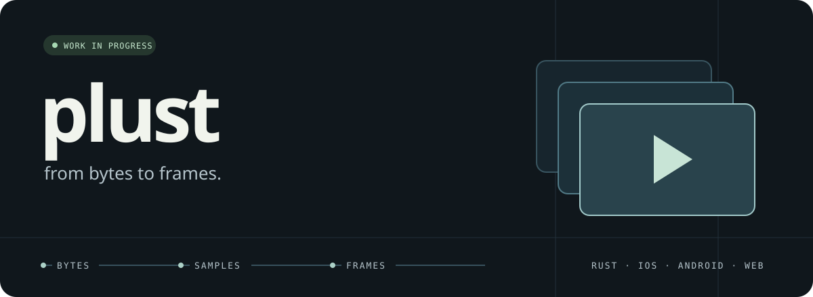
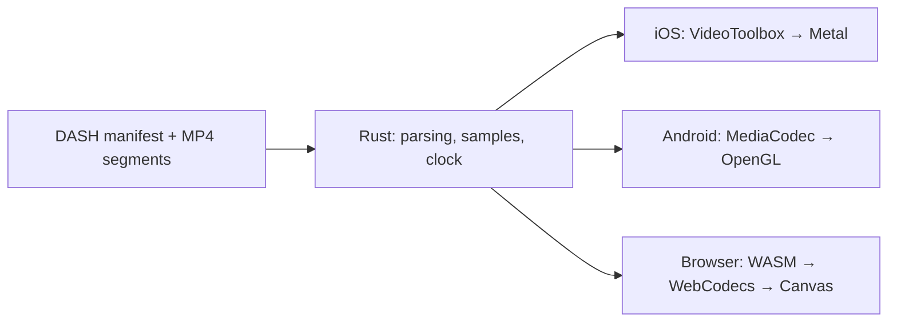

<p align="center">
  
</p>

# Plust

**A video player, from bytes to frames.**

Work in progress · Rust · Swift · Kotlin · WebAssembly

I built Plust to understand what happens between a media file and a frame on screen: parsing the container, finding samples, decoding them, and deciding when to display each frame.

I'm returning to the project to understand those pieces more deeply and document what I learn. The first focus is **MP4 parsing**. This repository is a snapshot of the existing prototype, with iOS, Android, and browser implementations. It is still experimental.

## How it fits together

The Rust core reads a DASH manifest, downloads fragmented MP4 segments, extracts compressed samples and their timestamps, and tracks playback time. Each platform handles decoding and rendering.



| Part | Source |
| --- | --- |
| Container parsing and codec configuration | [`plust-core/src/fmp4.rs`](plust-core/src/fmp4.rs) |
| Segment metadata and sample extraction | [`segment.rs`](plust-core/src/segment.rs), [`demuxer.rs`](plust-core/src/demuxer.rs) |
| Playback time and loading | [`clock.rs`](plust-core/src/clock.rs), [`player.rs`](plust-core/src/player.rs) |
| iOS prototype | [`swust/`](swust/) |
| Android prototype | [`rustdroid/`](rustdroid/) |
| Browser prototype | [`rustascript/`](rustascript/) |

## Where it stands

- The source includes DASH parsing, fragmented MP4 sample extraction, H.264 codec configuration, a playback clock, and platform integrations.
- The clock and sample buffer have local unit tests. Other existing tests expect media served at `http://localhost:8080`.
- Seeking currently updates the clock; repositioning loading, buffered samples, and decoders is unfinished.
- Loading currently selects the first representation. Adaptive bitrate switching is unfinished.
- The loader does not yet bound its compressed-sample queue. Error handling, cancellation, and memory behavior need further work.
- The native and browser playback paths need to be re-verified as this project resumes. There is no hosted demo yet.

## Start exploring

Install a Rust toolchain, then run the tests that do not need a media server:

```sh
cd plust-core
cargo test --locked --lib clock::tests
cargo test --locked --lib sample_buffer::tests
```

For the browser prototype, install `wasm-pack` and build the bindings:

```sh
cd plust-core
make wasm
cd ..
python3 -m http.server 3000 --bind 127.0.0.1
```

Then open `http://localhost:3000/rustascript/test-player.html` in a browser with WebCodecs support. The prototype also requires a **separate compatible DASH media server** at `http://localhost:8080`, with CORS enabled. It expects `stream.mpd`, an H.264 representation, and numbered fragmented MP4 segments described by a duration-based `SegmentTemplate`. Media fixtures are not bundled. Preparing a reproducible sample is part of the work ahead.

The native prototypes are under `swust/` (Xcode) and `rustdroid/` (Android Studio). They require the corresponding SDKs and Rust targets; Android also uses `cargo-ndk`. Their build setup is still being revisited.

## What I'm learning next

1. Follow one MP4 box through the parser and account for every byte read.
2. Trace a compressed sample from its segment to a decoded frame.
3. Make the prototype reproducible with a documented sample and demo.

See [the learning notes](docs/learning.md) for the starting point.
